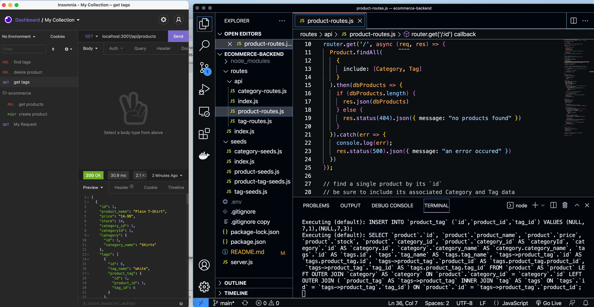

# ecommerce-backend

## Description ##

Brief description of application:

Link to deployed app: <https://express-note-taker-cmp.herokuapp.com/notes>

This application is a simple example of a working ecommerce site including just the Model and Controller functionality of the MVC. The controller is based on the Express.js package and the Model is based on Sequelize package. It provides full CRUD capabilities for Products, Categoris and Tags if driven using Insomnia or similar. It depends on Express.js for API routing.

The User Story:
AS A manager at an internet retail company
I WANT a back end for my e-commerce website that uses the latest technologies
SO THAT my company can compete with other e-commerce companies.

Note: this application is covered by the  license

## Table of Contents ##

* [Installation](#installation)
* [Usage](#usage)
* [License](#license)
* [Contributing](#contributing)
* [Tests](#tests)¬¬
* [Questions](#questions)

- - -

## Installation ##
Below are brief instructions on how to install:

You will need node.js with mysql2, sequelize, express, dotenv, packages. You can download the basic files to build the application. 
Note if you clone the repo, you will need to create your own .env file to run the application as we are using environmental varialbles to store database credentials.

## Usage ##
How to use this application: 

Once you have cloned the repo and set up node and the dependencies, created the .env file, you can run from the terminal using bash or zsh on mac. 

## License ##
This application is covered by the following license: 

Creative Commons license family 4.0

## Contributing ##
This project was developed by Chris Pysden as part of the UW Bootcamp Certificate Course for Full Stack Developers. If you would like to contribute to improving this project, then you'd be very welcome. Please follow the following guidelines (which are loosely based on Atom project guidelines):

* send an email to me using the links below to request to be added to the project and improvements briefly describe the improvements you'd like to make
* always create a new branch that encapsulates your changes
* notifiy me before commiting any updates/changes
* track all bugs as issues in the project
* have fun

## Tests ##
Tests included are referenced below:

Test:  

I am working on implementing some basic tests to check validity of the input and to ensure consistency. Currently there are no tests that ship with the code.

## Questions ##

My Github profile is here: <https://github.com/cpysden-coder>

Please contact me with questions at <chris_pysden@mac.com>
